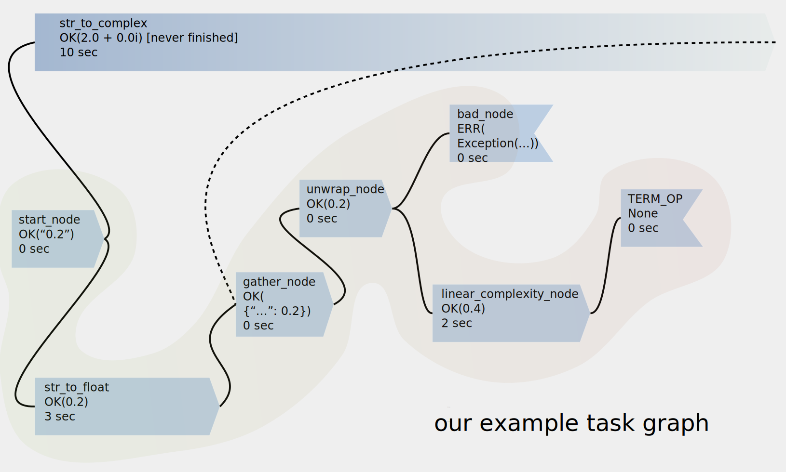

# task graph scheduler

Single-file asyncio-based python library for scheduling tasks with complex relationships.

### requirements & installation
* **Tested with python 3.7, 3.9, 3.10, but should work with other python3 versions**
* Requires standard library only
* Sorry, for now there is no convenient way to install the library. Just download the code.
### toy example:
```python
from time import time
import asyncio
import task_graph as tg  # source/task_graph.py

# set up some dummy async functions:
async def str_to_complex(x: str) -> int:
    await asyncio.sleep(10)  # conversion to complex is really complex :\
    return complex(x)

async def str_to_float(x: str) -> float:
    await asyncio.sleep(3)  # float is much easier
    return float(x)

async def linear_complexity(x: float) -> float:
    await asyncio.sleep(x)
    return x * 2

async def bad_task(x) -> None:
    raise Exception("error occurred mid-task")

def gather_unwrap(x: dict) -> float:
    return x.popitem()[1]  # tg.GatherN result is a Dict[str, Union[Any, Exception]]

# now build the graph:
start_node = tg.NoOp(tg.Result.lift("2.0"))
to_complex_node = start_node >= tg.Func(str_to_complex)
# `>=` is a "do_after" operator for tg.Operation subclasses. returns second operand
to_float_node = start_node >= tg.Func(str_to_float)  # parallel with to_int_node
gather = tg.GatherN([to_complex_node, to_float_node], n=1)  # wait for one task to finish
unwrap_result_node: tg.Func = gather >= tg.Func(gather_unwrap)
bad_node = unwrap_result_node >= tg.NoOp(tg.Result.lift("any").map(bad_task))  # will immediately fail
lin_complexity_node = unwrap_result_node | linear_complexity
lin_complexity_node >= tg.TERM_OP  # TERM_OP is a termination signal

# print the graph
print("Task Graph:\n" + "\n".join(
    f"{v1}  --| {e12} |-->  {v2}" for (v1, v2, e12)
    in tg.TaskExecutor.trace_graph([start_node, ])
))

# run the graph
executor = tg.TaskExecutor()
start_time = time()
lin_complexity_node_ = asyncio.run(executor([start_node, ]))  # Operation preceding TERM_OP is returned
execution_time = time() - start_time

# examine the results
print("execution time: ", execution_time)
assert (~~lin_complexity_node_) == 2.0 * 2
print(f"{bad_node} result was {repr(bad_node.result.box)}")  # this was bound to fail, remember?
try:
    ~~to_complex_node  # trying to unwrap it will raise an error,
    # since task takes 10 s but the TERM_OP was encountered in ~ 5s
except asyncio.futures.CancelledError as e:
    print(f"{to_complex_node} was cancelled")
```
Output:
```
Task Graph:
None  --| None |-->  0000_NoOp(task_graph.Result(0, 2.0))
0000_NoOp(task_graph.Result(0, 2.0))  --| None |-->  0001_Func(None)
0000_NoOp(task_graph.Result(0, 2.0))  --| None |-->  0002_Func(None)
<...>
execution time:  5.00627
0005_NoOp(task_graph.Result(1, error occurred mid-task)) result was Exception('error occurred mid-task')
0001_Func(task_graph.Result(1, )) was cancelled
```
The task execution order looks like this:

see [`source/tests.py`](source/tests.py) to get a more usage examples.